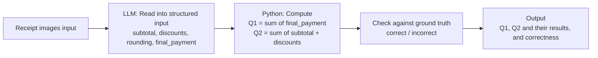

# FTEC5660 Homework 1: Receipt Chain

Build a LangChain pipeline that reads every supermarket receipt in a folder
with the vision-capable DeepSeek Flash model and answers these two questions:

1. How much money did I spend in total for these bills?
2. How much would I have had to pay without the discount?

For this homework, **amount spent** means the final payment after the receipt's
rounding line. **Without the discount** means the sum of the original positive
item prices: add back every promotion, coupon, member, app, packaging-damage,
and percentage discount, but do not add back rounding.

## Student task

Only edit the two functions in `hw1.py` that contain `### YOUR CODE HERE`:

- `build_chain()` creates your LangChain chain.
- `answer_queries()` runs the chain on the receipt images and returns one final
  response for each question.

You may use prompt chaining, routing, parallel calls, reflection, or a
combination. Your final responses should each contain one HKD amount. Do not
hard-code filenames or public answers; grading uses unseen receipt folders.

## Setup and public test

```bash
python3 -m venv .venv
source .venv/bin/activate
pip install -r requirements.txt
```

Put your DeepSeek key after `DEEPSEEK_API_KEY=` in `.env`, then run:

```bash
python3 hw1.py --image-folder public_test
```

The program creates `results.csv` in the current directory. Its columns are
`query`, `model_response`, and `correctness`. The public answers are in
`public_test/ground_truth.json`. The starter intentionally returns the dummy
response `please design your chain to answer these two queries.` so it runs
before you add any API code.

The required model is `deepseek-v4-flash-vision-exp`, the vision-capable
DeepSeek Flash model. JPEG, PNG, GIF, and WebP inputs are accepted by the
homework runner.


## Homework 1 solution: 

### Chain design



### Description

My chain separates extraction from arithmetic. In `build_chain()` I create a single LangChain pipeline that combines a `ChatPromptTemplate` with the vision-capable `deepseek-v4-flash-vision-exp` model and a `JsonOutputParser`. Each receipt image is encoded as a base64 data URL by the provided `image_data_url()` helper, embedded as an `image_url` block in a multimodal human message, and the model is asked to return a strict JSON object with four keys: `subtotal`, `discounts` (all promotions, coupons and percentage discounts as positive numbers), `rounding`, and `final_payment` (the amount actually paid after rounding). In `answer_queries()` I call `chain.batch()` over all receipts in the folder, which keeps each receipt independent and lets the chain run in parallel. I then perform all arithmetic in plain Python: `QUERY_1` is the sum of every receipt's `final_payment`, and `QUERY_2` is the sum of every receipt's `subtotal` plus its `discounts` (rounding is deliberately excluded). Both totals are formatted with `Decimal.quantize(Decimal("0.01"))` and returned as strings such as `"HK$1974.30"`, so each response contains exactly one HKD amount. The runner then writes `results.csv`, compares each answer against `public_test/ground_truth.json`, and the final `results.csv` reports `correct` for both queries. Keeping the LLM responsible only for reading the receipt and Python responsible for the totals makes the result reproducible and easy to debug.

## Task 2: Reflection

Over the past ten days, the rapid progress of AI models has strongly reshaped how I think about my career in FinTech. What struck me most was not a single headline, but the accelerating pattern: every week brings cheaper, faster, and more capable models, and tools that once required a dedicated engineering team are now accessible to anyone with an API key. This trend directly echoes an experience I had during my internship at a securities firm.

During that internship, one of my recurring tasks was to compile each client's monthly securities trading activity over the past year into a single, presentable document. With hundreds of clients, the work was repetitive, time-consuming, and error-prone. Each report required pulling transaction data, standardizing formats, and double-checking figures — work that added little analytical value but consumed enormous human effort. At the time, my team was given free API tokens and access to Claude. I used it to automate the extraction and aggregation of the trading data, and the result was remarkable: what used to take days was compressed into hours, and the accuracy actually improved because the model never got tired.

That experience changed two things in my perspective. First, I no longer see AI as a threat to entry-level finance jobs, but as a force that removes the least meaningful parts of them. The value of a junior analyst will increasingly come from asking the right questions, validating AI outputs, and interpreting results — not from manual data entry. Second, I now believe that FinTech professionals must be bilingual: fluent in financial concepts and comfortable with AI tooling. My career plan has shifted accordingly. I want to move beyond traditional finance roles and position myself at the intersection of finance and AI — building or supervising pipelines that turn raw financial data into decisions, much like the receipt chain I built for this assignment.
